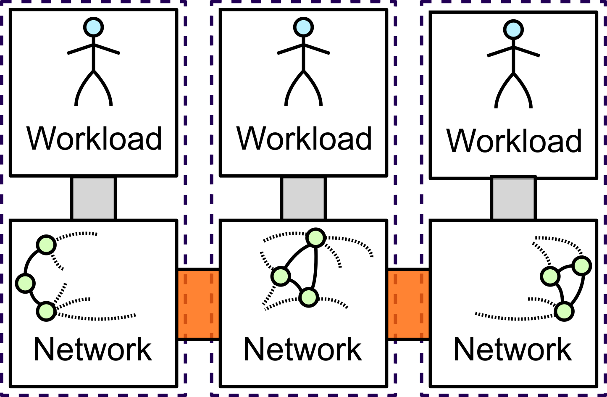
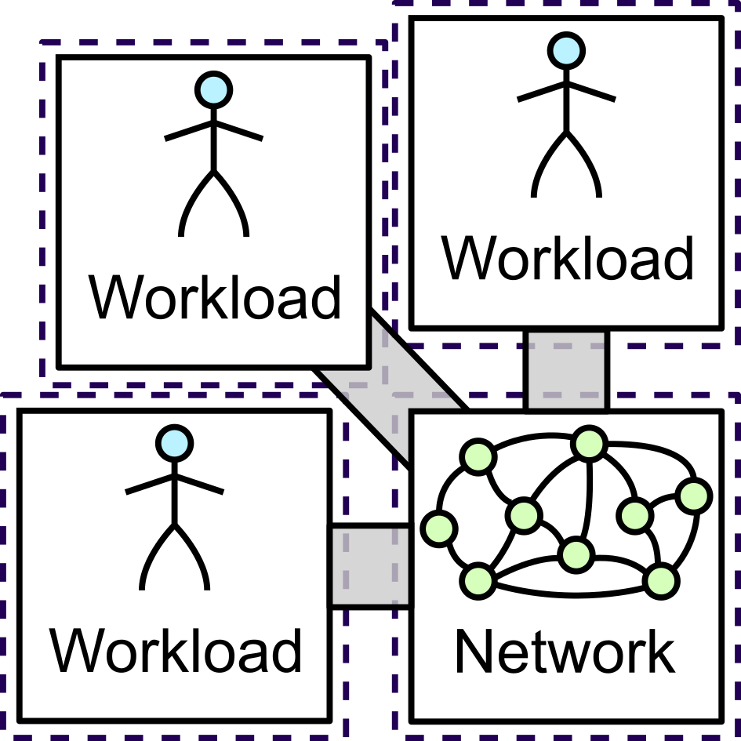
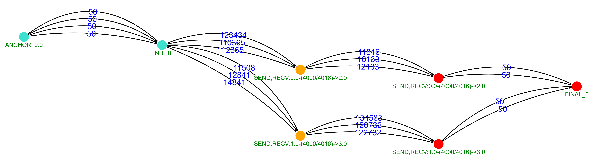
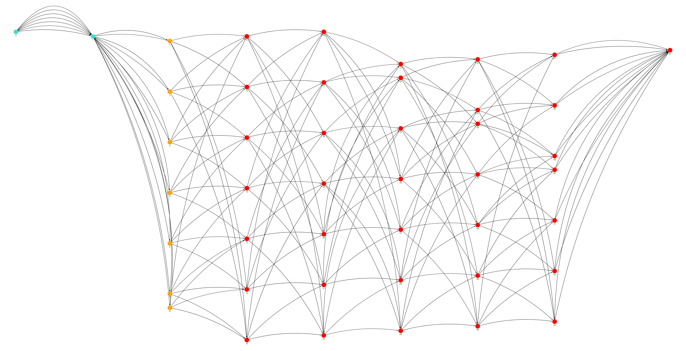
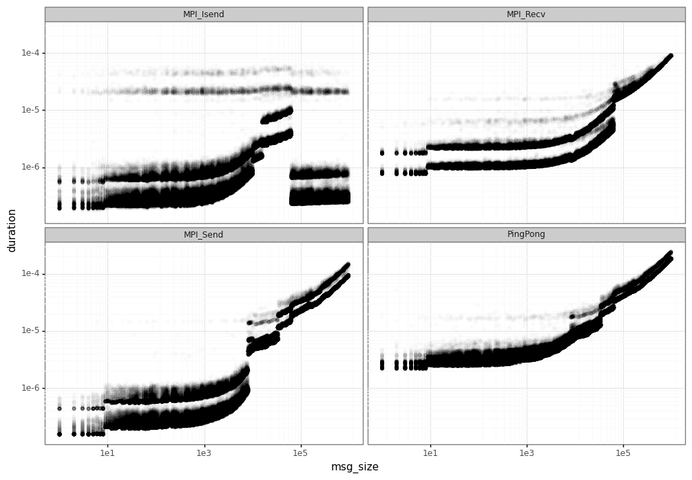
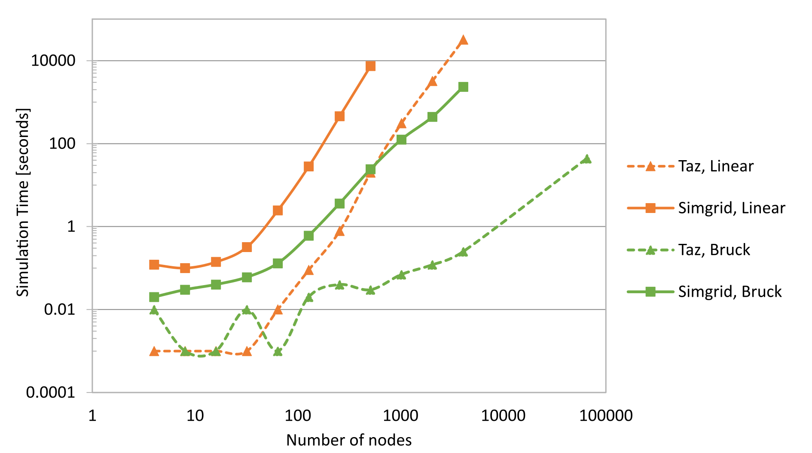
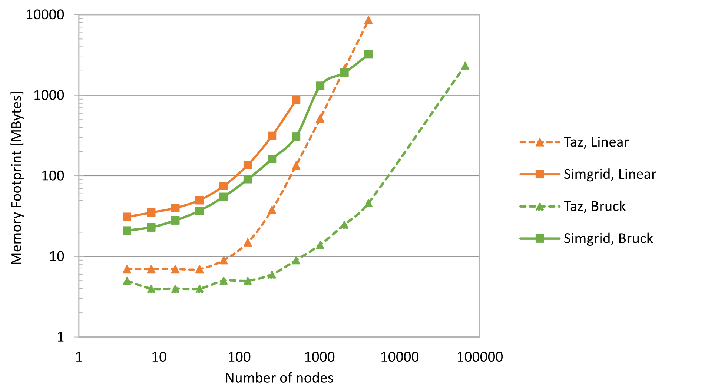
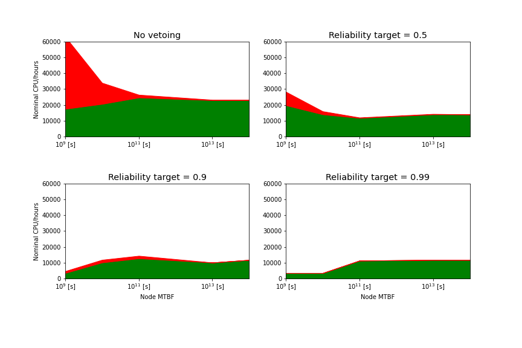

# Taz: a fast-er HPC network simulator for resiliency studies


[[_TOC_]]

## What is Taz ?

Taz is tool that can simulate an unreliable HPC cluster very fast, or at least much faster than alternatives of similar accuracy. In more details, Taz 
replays traces from multiple MPI applications, that are scheduled using different resource management policies. More details on how Taz works are given in [this section](#architecture).

Why the name then? Well, Taz is a [tasmanian devil character from the Looney Tunes](https://en.wikipedia.org/wiki/Tasmanian_Devil_(Looney_Tunes)) that spins very fast, often creates a lot of damage, and is sometimes sweet. We hope that our tool will spin as fast as he does, that its failure emulation features will be comprehensive enough to be useful to people, and that you will like using it :smile:.   

Taz is still in a very early stage, which means:
* While we try to test it (~500 regression tests), coverage is very very low, and stuff **will break** if you deviate from what we do.
* We have not properly validated results provided by Taz (but we are looking to get that soon).
* We expect the software to change quite a bit still, which means extending it requires care (c.f. [this section](#extending-taz)).  

## Installing Taz

Taz works in a Linux environment with GCC. It might work with Clang with a few fixes, and its core used to run on Windows, but some dependencies do not. 

Here is a non-exhaustive list of the other mandatory dependencies:
* Cmake build system (>=3.13)
* C/C++ compilers (gcc, clang) 
* Boost libraries >=1.74.0 ( program_options, stacktrace, heap (header-only) )
* python 3 (with pip, it will try to install the gravis library for graph vizualization)
* [Scotch: a software package for graph computations](https://gitlab.inria.fr/scotch/scotch), imported as a Git submodule. 
* Fortran compiler (Scotch requirement)
* bison (Scotch requirement)
* flex (Scotch requirement)

Optional Taz dependencies:
* [PAPI: The Performance Application Programming Interface](https://github.com/icl-utk-edu/papi)
* [VScode IDE](https://code.visualstudio.com/) to make developments easier. Note that VScode can work with the working copy in WSL nicely.

Taz uses the Cmake build system, hence you may build it with:

```
$> cmake .
$> make
```

You will probably want to modify compile parameters using `ccmake .`, and in particular set the CMAKE_BUILD_TYPE variable to Debug or Release, depending on whether you want to track a problem or run fast.  

## Using Taz

Having a glance at the [architecture section](#architecture) will be very helful to understand the way Taz works. There are also a lot of tests generated that can help you getting started. Also, we use the [VScode IDE](https://code.visualstudio.com/) to develop Taz, and we get debug and run profiles generated automatically.

Taz provides various outputs, either as CSV files or as structured snapshots. We have a set of Python scripts to help with post-processing. 

Following is the help prompt for the Taz command. Hopefully this is verbose enough for you to get an indication on what you want to do, but eventually, you might have to go through to the source code :fearful:.

```
Taz options:

Global options:
  --help                                produce help message
  -c [ --conf ] arg                     Additional configuration files to be
                                        parsed AFTER the command line arguments
  --cores_per_host_region arg (=1)      Number of cores in each Uniform Memory
                                        Access region
  --host_regions arg (=1)               Number of Uniform Memory Access regions
                                        in each host. Assuming 1, 2 or 4.
  -t [ --topology ] arg                 The topology to simulate among
                                        TINY=16n|MEDIUM=1024n|LARGE=64KnThis
                                        does not include connections between
                                        host regions (which are generated
                                        automatically).Alternatively, one may
                                        describe a torus using this syntax:
                                        TORUS:i,j,k,l,..,n where i,j,k,l,..,n
                                        are sizes in the different torus
                                        dimensions.
                                        Instead a fat tree could be described
                                        with:
                                        FATTREE:n:c0,..,cn:p0,..pn:l0,..ln
                                        where:
                                         n is the number of switch levels
                                         c0..cn is the number of children of
                                        each switch, for each level.
                                         p0..pn is the number of parents for
                                        each switch/host, for each level.
                                         l0..ln is the number of links for each
                                        child-parent pair, for each level

  --warmup_period arg (=1000)           Job statistics are ignored until the
                                        end of the warmup time, in seconds.
  --drain_period arg (=1000)            Job statistics are ignored after the
                                        start of the drain period, before
                                        endtime, in seconds.
  -e [ --endtime ] arg (=3600)          The maximum time at which the
                                        simulation will end.

Job options:
  -j [ --job_ti ] arg                   The description of TIme Independent
                                        (ti) applicative trace for a job. The
                                        last value defined for job options
                                        before  this argument are applied.If it
                                        start with ';', this is a
                                        semicomma-separated list of trace
                                        elements. Syntax is ;<number of
                                        processes>;<line 1>;<line2>;...;<lineN>
                                        .Otherwise, the value is the path to
                                        the index file
  -a [ --job_avail ] arg                The time when the following job(s) will
                                        be available for scheduling
  --job_repeat arg                      If 0, job is NOT repeated. If positive,
                                        defines the delay between the end of a
                                        job instance to the availability of the
                                        next.
  --job_nominal arg                     The nominal spantime for this job, to
                                        compute system productivity
  --job_timeout arg                     The time after which the job is assumed
                                        crashed,  and drained from the system
  --job_iterations arg                  For traces that support iteration,
                                        define how many iterations will be
                                        executed before proceeding to the
                                        epilog of the job. Negative values mean
                                        to just run the original trace.
  --job_compute_factor arg              Apply factor to the compute times given
                                        in traces. Can be used to compensate
                                        for tracing issues, or to  artifically
                                        expand traces in time.

Platform options:
  --link_capacity arg (=1250000000)     The capacity of the interconnect links
                                        in Bytes per second
  --loopback_link_capacity arg (=125000000000)
                                        The capacity of the processor-internal
                                        links in Bytes per second
  --link_concurrency arg (=4096)        The number of flows that can go though
                                        at link at a given time. For now, only
                                        the first link of the route is checked.
  --link_latency arg (=1000)            The latency of the interconnect links
                                        in nanoseconds
  --loopback_link_latency arg (=10)     The latency of the processor-internal
                                        links in nanoseconds
  --node_flops arg (=100000000000)      The power of processors in FLOPS
  --schedule_period arg (=30)           The period between two scheduling calls
                                        to the resource manager, in seconds.
  --mapping_reliability_target arg (=0) Criteria to discard unreliable nodes
                                        during mapping. Roughly, the Resource
                                        Manager tries to get the probability
                                        that the job completes to at least this
                                        target.Hence 0 means we do not care
                                        about jobs failing, and 1 means we want
                                        to be sure the job will succceed, but
                                        this could prove difficult/impossible.
  --soft_latency arg (=50)              The minimum software latency inserted
                                        between actions, in nanoseconds
  --allreduce_latency arg (=200)        The latency to perform a reduction, in
                                        nanoseconds

Simulation internal options:
  --share_unit arg (=1)                 The granularity to share resources
  --share_change_threshold arg (=1)     Changes in share within
                                        +-share_change_threshold/128 will be
                                        ignored by the LMM model.
  --simtime_precision arg (=50)         The time granularity to recompute
                                        sharings in the LMM model, in
                                        nanoseconds
  --model_gamma arg (=1)                The gamma parameter
  --model_weight_s arg (=1)             The Weight-S parameter
  --model_latency_factors arg (=0:*1+0) The latency factors parameter. Syntax
                                        is <lower>:*<mult>+<add>,<lower>:*<mult
                                        >+<add>. For instance,
                                        0:*3.5+24,64:*1.01+52. Unit for add is
                                        nanoseconds.
  --model_bandwidth_factors arg (=0:*1+16)
                                        The bandwidth factors parameter. Syntax
                                        is <lower>:*<mult>+<add>,<lower>:*<mult
                                        >+<add>. For instance,
                                        0:*3.5+24,64:*1.01+52. Unit for add is
                                        bytes.
  --maximum_fanin_fanout arg (=120)     Split large fan-ins and fan-out of
                                        action dependencies to this size.

Software communication options:
  --eager_threshold arg (=256)          Messages smaller than the threshold use
                                        Eager protocol. Larger ones use
                                        Rendezvous.
  --forced_segsize arg                  When set, this is the segment size to
                                        use when the algorithm requires a
                                        segment size
  --forced_max_outstanding_reqs arg     When set, maximum outstanding requests
                                        to use when the algorithm requires a
                                        maximum outstanding request number
  --allreduce_alg arg                   Force the algorithm used for the
                                        AllReduce primitive
  --allgather_alg arg                   Force the algorithm used for the
                                        AllGather primitive
  --alltoall_alg arg                    Force the algorithm used for the
                                        Alltoall primitive
  --barrier_alg arg                     Force the algorithm used for the
                                        Barrier primitive
  --bcast_alg arg                       Force the algorithm used for the
                                        Broadcast primitive
  --reduce_alg arg                      Force the algorithm used for the Reduce
                                        primitive

Fault injection options:
  --node_fault_profile arg              Optionally define a set a deterministic
                                        set of failure and recovery events for
                                        a given node. Use one argument per
                                        node.Syntax is: <nodeindex>:<failtime1>
                                        -<recovertime1>:...:<failtimeN>~<recove
                                        rtimeN> where <nodeindex> is the ID of
                                        the node, and <failtimeX> (resp.
                                        <recovertimeX>) are absolute times that
                                        must increase. One must specify both
                                        failure and recovery time. For the
                                        later, 'END' can be used to specify
                                        that resource will not recover during
                                        the simulation
  --node_nominal_mtbf_log10 arg (=7.5)  The log10 of the nominal Mean Time
                                        Between Failures for hosts, in seconds.
                                        This applies after the fault profile
                                        has finished
  --node_nominal_mttr_log10 arg (=4)    The log10 of the nominal Mean Time To
                                        Repair for hosts, in seconds. This
                                        applies after the fault profile has
                                        finished
  --link_fault_profile arg              Optionally define a set a deterministic
                                        set of failure and recovery events for
                                        a given link. Use one argument per
                                        link.Syntax is: <linkindex>:<failtime1>
                                        -<recovertime1>:...:<failtimeN>~<recove
                                        rtimeN> where <linkindex> is the ID of
                                        the link, and <failtimeX> (resp.
                                        <recovertimeX>) are absolute times that
                                        must increase. One must specify both
                                        failure and recovery time. For the
                                        later, 'END' can be used to specify
                                        that resource will not recover during
                                        the simulation
  --link_nominal_mtbf_log10 arg (=8.5)  The log10 of the nominal Mean Time
                                        Between Failures for link, in seconds.
  --link_nominal_mttr_log10 arg (=4)    The log10 of the nominal Mean Time To
                                        Repair for links, in seconds. This
                                        applies after the fault profile has
                                        finished
  --mtbf_stdev_scale_log10 arg (=1.5)   The stdev used to pick the scale of
                                        link and nodes Weibul distribution.
  --mtbf_stdev_shape_log10 arg (=0.29999999999999999)
                                        The stdev used to pick the shape of
                                        link and nodes Weibul distribution.
  --mtbf_clamping_factor arg (=3)       Clamping factor to compute actual Mean
                                        Time Between Failures, w.r.t. stddev.
  --mttr_stdev_log10 arg (=3)           The stdev used to pick the recovery
                                        times.

Debug and reporting options:
  --stats_folder arg (=.)               The folder where resulting statistics
                                        and snapshots will be written.
  --stats_suffix arg (=0)               The suffix for resulting files.
  --stats_period arg (=30)              Sampling period of statistics (and
                                        progress display), in seconds.
  --snapshots_type arg (=0)             What type of snapshots of the action
                                        graph should we take? 0:No, 1:Skip
                                        invalids, 2:Print all, 3:Short, -1:Only
                                        stats
  --snapshots_format arg (=dot)         What format do we write snapshots to?
                                        dot or pydict
  --snapshots_occurence arg (=0)        When should we take snapshots of the
                                        action graph? Bitmask: 1:After parsing,
                                        2: After each engine internal
                                        iteration, 4:After engine run, 8:On
                                        simulation end
  --inhibit_debug_messages arg (=0)     Should we inhibit debug messages?
  --inhibit_verbose_messages arg (=1)   Should we inhibit verbose messages?
  --parse_only arg (=0)                 Only parse traces (e.g. to capture
                                        snapshots).
```


## Taz Architecture

For our work on HPC system resilience, we need an alternative to Simgrid framework that is significantly faster for our use case. Obviously, it is not possible to reproduce the full feature set of Simgrid, but we were able to adapt a minimal feature set, with the capability to add features later on. In this section, we present key aspects of this tool, and then assess its performance. Although most features are comparable with Simgrid, our drastic redesign allowed this tool to be orders of magnitude faster than Simgrid in critical parts of the simulation.


### Event simulation with dependencies

At an abstract level, flow-level simulators process messages coming from the workload model. Then a network model is responsible to compute the estimated completion time for the transmission of these messages, before returning this information to the workload model. The following figure presents different architectures for such models. Initially, models integrated both functions in the same process. However, single thread performance limited the achievable throughput. 


Hence Parallel Deterministic Event Simulators (PDES) were proposed, where functions are spread across different processes and/or machines. However, the synchronization between those parts is critical unless a stable partitioning of the communications exists naturally in the simulated workload. 



Another approach, championed by Simgrid, is to keep the network model in a single thread, but let the workload model spread across other threads or processes. In the case where actual applications are run, this greatly improves throughput, without inducing synchronization issues. Unfortunately, the coupling between the network model and the workload functionalities is very tight in Simgrid, and limits the benefits of this parallelization approach.




In practice, a flow-level model such as Simgrid handles events (mostly start of a new flow and completion of an ongoing flow). Each of these events triggers the update of the network model. This in turn modifies the completion time of ongoing flows. In Simgrid, each event cause a switch between the network model context and the workload model context. One source of improvement with respect to Simgrid is that the synchronicity of many interactions between the workload model and the network model could be relaxed without loss of precision. When an application trace is replayed or a completely deterministic application is simulated, the computation of the network model can be deferred without affecting the result of the simulation. Only when a non-deterministic or a time-based operation occurs, does the network model need to synchronize with the workload model. Hence, the number of switches between network model and workload model contexts can be reduced significantly. Based on this observation, Taz lays a graph of dependencies among events ahead of time and leaves the network model to progress mostly independently. Initially, this approach reduces the overhead tied to the change of context. In the future, we also expect that this approach will allow the scalable parallelization of the simulator functions across different machines. Furthermore, we expect that some features of the single network model process will be delegated to the multiple workload model processes (e.g. message matching, collective decomposition); which will improve throughput even further.

The following figure shows the dependency graph generated for a simple example where four processes exchange messages. In this graph, edges represent timely dependencies, and vertices represent communications. In that example, node 0 sends two messages to node 2 sequentially; and node 1 sends two messages to node 3 sequentially. The application start is modeled by the ANCHOR action. A collective init primitive is issued 50ns afterwards. Before starting the first pair of transmissions (in orange in the figure), we need to wait for computations to be executed in each endpoint of the transmission and for communication zero-load delays, as represented by the different edges of the graph. In effect, in this graph, dependencies embed both computation and transmission delays, and they include information necessary for non-deterministic applications, although currently the format of application traces preclude us from modeling such behaviours. In addition, communications contain information about the preconditions necessary for the start event to be triggered, as well as the used network resources and the amount of data to be exchanged. We also keep track of their state. This allows the modeling of non-blocking operations.




Another more complex example is proposed in the next figure. In that case a collective primitive (All-to-all) is decomposed in messages. Even for a very small set of nodes (7 ranks), the complexity of the dependencies is quite high.




### Communication modeling

In a high-performance computing context, the modeling of even point-to-point communications involves quite some complexity. In \cite{simgrid_calibration}, tools are provided to analyze the behaviour of actual systems. The following figure presents the output of these tools for the actual Grid’5000 dahu cluster. This figure presents the latency of different MPI point-to-point primitives, with respect to the size of exchanged messages, in a logarithmic scale. We observe non linearity, which is caused by the utilization of different software and hardware transmission mechanisms in the actual system. We also observe that the transmission efficiency greatly varies depending on the size of the message. The modeling mechanisms are twofold.
First, Simgrid introduced correction factors to represent the efficiencies. Based on the size of the message, the associated latency and cost can be adjusted.
Second, the simulator models both Eager protocol, in which case message is sent as soon as the sender is ready; and Rendezvous protocol, in which case the sender waits for the receiver before transmitting. Our tool includes both mechanisms. The support of the Eager and Rendezvous protocol is enabled by the generation of different patterns in the generated dependency graph.




In addition, MPI supports both blocking and non-blocking communications. Our tool models both paradigms. For non-blocking paradigms, only Wait and WaitAll primitives are currently supported for synchronization, although non-deterministic primitives such as WaitAny and Test variants could be supported rather easily. MPI also allows users to use tags to match potentially concurrent communications. Our tool supports this tag matching function, although not in an optimal way.

Finally, one-sided operations can also be represented in the dependency graph, although we have not yet developed that aspect.

### Collectives decomposition

On top of point-to-point operations, collective operations are very useful to efficiently perform communications involving more than two processes.
In mainstream implementations such as Open MPI or MPICH, there is a huge complexity as to how each collective is actually implemented.
In effect, for each collective primitive, a few implementations with complementary figures of merit are present, and one is selected at run time, depending on the size of the message and the number of participants.
In our tool, we only implemented a few primitives, and approximated the implementations present in the Open MPI base configuration. The following table presents the supported primitives and the various implementations.

| Primitive | Impl.1 | Impl.2 | Impl.3 | Impl.4 | Impl.5 |
|----------:|--------|--------|--------|--------|--------|
| Barrier   | Bruck  | RDb                               |
| Bcast     | Linear | Pipeline | Binomial tree | Split Binary tree | 
| Reduce    | Linear | Pipeline | Binomial tree | Binary tree |
| Alltoall  | Linear | Bruck | Ring                      |
| AllGather | Pair   | RDb   | Bruck | Ring | Neighbor exchange | 
| AllReduce | Reduce+Bcast | RDb | lr | Ring segmented | RAB RDb | 

Currently supported collective applications and implementations, following Open MPI naming

The Bruck and Recursive doubling (denoted RDb) decompose the collectives into multiple rounds where increasing distant nodes (in the rank order sense) communicate with each other. The Ring implementation also uses multiple rounds, but the ranks only communicate with their neighbors. The Linear implementation just posts all communications at once and waits for messages. There are also collective implementations that build their communication schedule on top of a tree.
In our tool, when the trace parser reaches a collective, it is decomposed in a Directed Acyclic Graph (DAG)
of dependencies and communications at once, without requiring message matching.

### Failure support

Our tool is targeted at resiliency modeling. We do not model communication faults that are recovered by the transport layer. Instead, we focus on failures that cannot be recovered, and provoke the termination of applications. Therefore, our tool comprises:

* Generic failure injection following random distribution as described and simple deterministic profiles for validation purposes.
* Node failures, which cause all jobs allocated to the node to abort immediately.
* Link failures, which cause all jobs using the link to abort instantaneously.
* Job abortion at the resource manager level.

### Topologies

Currently, our tool supports only the torus topology, although provisions have been made to support other topologies. In particular, we consider the addition of the fat tree topology to reflect that of the DEEP cluster. We also observe that upcoming Exascale systems tend to abandon strictly regular topologies in order to approach the Moore bound and reduce the network diameter. DragonFly is the most popular option at the moment, and we consider the possibility to also add this topology to Taz.
We have chosen to utilize specialized topology classes to maximize the tool performance, since generic computation of messages routing is time consuming for large topologies.

### Workload support

Currently, our tool only supports time-independent traces generated by Simgrid, owing to our goal to create a minimal tool and still fairly assess its performance with respect to the state-of-the-art. Yet, those traces allow the fast simulation of virtually any deterministic MPI application, although our tool can only parse a commonly used subset of the MPI primitives. This level of abstraction is a great match for the level of performance required in our studies, since it encapsulates just enough information to accurately adapt the application traffic to the network conditions.

The support for additional workloads is also envisioned, and would benefit from the decoupling between the Workload function and the Network model. First, we consider the possibility to integrate support for other trace formats. Second, it is conceivable to augment trace semantics to support non-deterministic applications. In a longer time scale, our tool may be extended to receive communication metadata from MPI applications in real time through the PMPI interface, and provide feedback in non-deterministic cases.

### Resource management

For our purposes, concurrent jobs execution is essential. Hence, a scheduling policy is required. Our tool only supports a First Come First Serve (FCFS) policy to select which job is granted access to resources. For practical reasons, we support the possibility for jobs to be re-submitted periodically. We consider the addition of backfilling to better model actual resource managers such as Slurm. The selection of the nodes to be allocated follows the linear approach, where all nodes are ordered arbitrarily, and available nodes are allocated in increasing order, regardless of any topological consideration.

### Sharing model of network resources

We managed to keep the overhead of previous functionalities very low. However, the core network model is time consuming due to the volume of events that need to be processed. For instance, in experiments presented in the Node vetoing , up to 300 million updates are required. Simgrid uses a variety of tricks to improve performance (e.g., partial sharing update, dense data structures). Our tool leverages those techniques and introduces many additional ones. First, while Simgrid uses floating point values, we perform integer computations.
Second, we aggressively prune updates in time (i.e. we delay updates until we reach a predefined simulation step) and in sharing granularity (i.e. we trigger a sharing update only if we expect that the share allocated to each message will vary significantly).
Our preliminary experiments do not show significant accuracy degradation compared to Simgrid. We plan to assess rigorously the accuracy of Taz in the final year of the DEEP-SEA project.

### Performance compared to Simgrid

In the next figure, we present the performance of our prototype compared to the state of the art (i.e. Simgrid). We focus on the worst case, when many messages are in-flight simultaneously. Hence, we simulate an Alltoall collective among $N$ nodes, using both the Linear implementation (which generates $N^2$ messages at once), and the Bruck implementation (that generates $N$ messages in $N$ different stages). We observe a consistent speedup of 2 to 3 orders of magnitude, and a memory footprint approximately 10 times smaller. Yet, we expect that further performance gains could be achieved using our prototype.




Performance comparison between Taz and Simgrid, for an Alltoall collective primitive for different number of nodes

## Case studies

### Nodes vetoing 

We also performed a case study using the developed simulator,
both to assess its interest and seed later experiments. In this case, we want to measure the impact that a resource manager would get if it attempted to allocate individual nodes based on a simple reliability criteria. In this initial attempt, the impact of checkpointing is not considered, which means that any progress is lost when the job crashes.
We also assume that the resource manager has access to an oracle that provides the exact failure law of each link and node, but not when the next failure will occur.

As for applications, we utilize time-independent traces from a panel of benchmarks. For each benchmark, the computation delays have been adjusted so that their nominal makespan ranges from a few minutes to a few hours, as shown in the next table. We use a subset of the NAS benchmarks as well as example runs of the miniAero application. The nominal makespan was measured by simulating the trace alone, in a system without failures. Each application is run periodically. The simulated system consists of 1000 nodes connected together with a 4D-torus.


| Benchmark name | Number of nodes | Nominal makespan [hh:mm:ss] |
|----------------|-----------------|-----------------------------|
| CG class D     | 256             | 4:50:06                     |
| CG class S     | 16              | 0:24:48                     |
| EP class D     | 256             | 6:26:50                     |
| EP class S     | 16              | 0:13:06                     |
| LU class D     | 256             | 1:04:48                     |
| LU class S     | 16              | 0:20:58                     |
| MG class D     | 256             | 6:46:47                     |
| MG class S     | 16              | 0:41:38                     |
| SP class D     | 256             | 0:57:29                     |
| SP class S     | 16              | 0:42:10                     |
| miniAero       | 4               | 1:09:47                     |
| miniAero       | 32              | 1:18:50                     |
| miniAero       | 128             | 3:17:37                     |
| miniAero       | 512             | 0:59:26                     |

Benchmark traces used for the case study

With the information provided by the above table, we can estimate the probability that some node of the allocated partition will fail  before the job is completed. However, instead of searching globally for contiguous partitions with minimum job failure probability, we iteratively select nodes such that a predefined reliability target $R$ is satisfied. This greedy approach has low complexity, but results in a lot of interferences across jobs, which diminishes the system efficiency as we will see.

Given a target job reliability $R$, we aim to preserve the relation presented in the equation below as we pick nodes ${n_1,..,n_i,..,n_N}$ for the job. Roughly, this equation expresses that we accept a node $i$ with failure probability $p^f_{n_i}$ only if filling the remaining job requirement using nodes with similar reliability did meet the process reliability target.

$$ R \leq  \left( 1 - p^f_{n_i} \right)^{N-i} \prod_{n=n_1}^{n_{i-1}} \left( 1 - p^f_n \right)$$

The equation below presents the resulting criterion used to veto nodes for each job:

$$ p^f_{n_i}  \leq \left( \frac{R}{\prod_{n=n_1}^{n_{i-1}} \left( 1 - p^f_n \right)}   \right) ^\frac{1}{N-i} $$

The next figure presents the performance of this approach, with a system of 1000 nodes running for 100 hours, with different individual node failure rate. To quantify the performance achieved by each configuration, we account for the nominal makespan of each completed and failed job. Overall, in this context, node vetoing does not improve the performance of the system, but it does clearly reduce the amount of aborted jobs.
In this system that may provide up to 100,000 CPU Hours over the simulated duration, we obtain only 23,000 CPU Hours in the best case (MTBF=$10^{14}$ seconds and no vetoing).

To an extent, this can be explained by the very trivial scheduling policy, which leaves resources idle and tends to create application interference. When node vetoing is employed, we observe that the amount of lost CPU hours decreases faster than the amount of useful CPU hours. For a reliability target of 0.5, the amount of useful CPU hours is comparable to the case without vetoing. More  strict targets show a dramatic decrease of useful CPU hours for low reliability cases, since many nodes are vetoed. Overall, we observe that simulations in this experiment last 20 minutes on average, which is very encouraging in terms of performance. We will assess the accuracy of our results in the final year of the DEEP-SEA project.



Completed jobs (in green) and failed jobs (in red) for different reliability targets and node reliability

## Extending Taz

Taz is in a very early stage, and we will most likely need to change most of the code at a point or another. However, for functions that are very likely to be extended, we create abstract classes from which one can derive, and we will try to keep the signature of those base classes as stable as possible. This includes:
* Collective primitives (`AbstractCS`)
* Workloads/ Trace parsers (`AbstractParser`)
* Network topologies (`AbstractTopology`)

In addition, note that we use `clang-format` to format automatically the source code. You may disable locally formatting using comments like that:
```
 // clang-format off
    <Stuff not to be touched >
 // clang-format on   
```

## TODO

* Support more complext resource management policies (leveraging Scotch)
* Validate results against Simgrid and/or actual system

## Acknowledgement and license

Taz has been developped in the [DEEP-SEA project](https://www.deep-projects.eu/). We thankfully acknowledge the support of the European Commission and the Greek General Secretariat for Research and Innovation under the EuroHPC Programme through project DEEP-SEA (GA-955606). National contributions from the involved state members (including the Greek General Secretariat for Research and Innovation) match the EuroHPC funding.

Taz is distributed under the GNU LESSER GENERAL PUBLIC LICENSE (LGPL), Version 2.1; of which a copy is enclosed.
